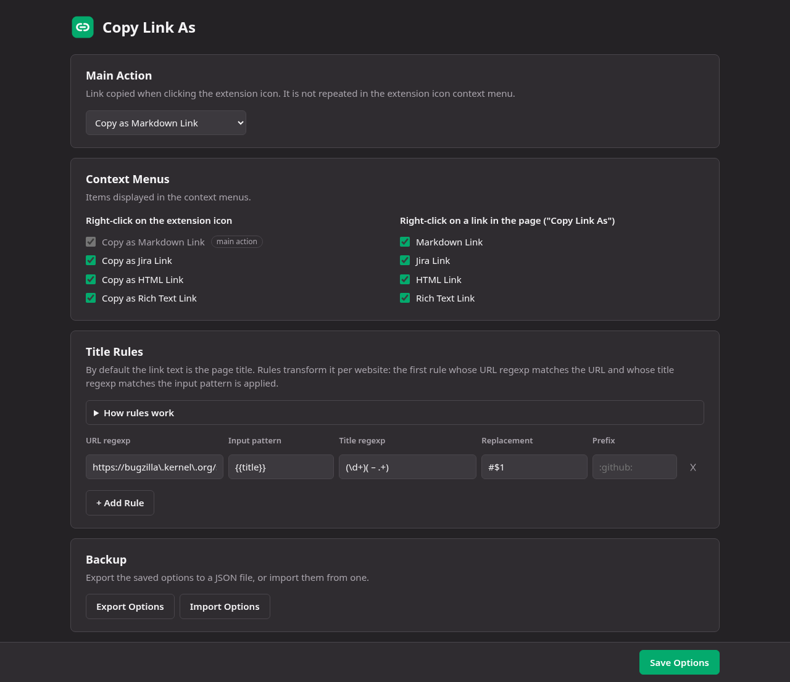

# Copy Link As

<p align="center">
  
</p>

Firefox (and Chrome) Extension to copy the current tab's URL and title as a Markdown/Jira/HTML/rich text link to the clipboard.

It is a fork of [Copy as Markdown Link](https://github.com/JayBeeDe/firefox_extensions/tree/main/caml) by JayBeeDe.

Copyright (C) 2025-2026 JayBeeDe, 2026 Julien Deniau (modified version).
Distributed under the [GNU General Public License v3.0](LICENSE): the packages published on the Firefox Add-ons and the Chrome Web Store include this license.

<p align="center">
    <a href="https://addons.mozilla.org/firefox/addon/copy-link-as/">
        
    </a>
</p>

<p align="center">
    <a href="https://chromewebstore.google.com/detail/onicfbcjjkagepepfmneheodahkckioj">Get 'Copy Link As' on the Chrome Web Store</a>
</p>

## How it works

### Simple Use

For example, suppose your active tab is <https://bugzilla.kernel.org/show_bug.cgi?id=220522>.

Trigger the extension action either by clicking the icon in the Firefox toolbar or by using the extension's keyboard shortcut configured near "Copy the current tab's URL and title as Markdown link" (default is `Ctrl+Alt+M`).


The title of the page is "220522 – iwlwifi: Wi-Fi 6 AX201 160MHz missing ucode firmware files"
So the markdown link copied to your clipboard is:

```markdown
[220522 – iwlwifi: Wi-Fi 6 AX201 160MHz missing ucode firmware files](https://bugzilla.kernel.org/show_bug.cgi?id=220522)
```

Which outputs: [220522 – iwlwifi: Wi-Fi 6 AX201 160MHz missing ucode firmware files](https://bugzilla.kernel.org/show_bug.cgi?id=220522).

### Advanced Use

Now let's suppose you are often working on this website and you want to simplify the link title. Suppose you want something like:

```markdown
[#220522](https://bugzilla.kernel.org/show_bug.cgi?id=220522)
```

Which outputs: [#220522](https://bugzilla.kernel.org/show_bug.cgi?id=220522).

To do that, open the extension preferences page and add the following rule:

- URL Match Regexp: `https://bugzilla\.kernel\.org/show_bug\.cgi.*`
- Input Pattern: `{{title}}` (default value)
- Title Match Regexp: `(\d+)( – .+)`
- Title Replacement Output Pattern: `#$1`



Do not forget to click "Save Options" button and go back to the <https://bugzilla.kernel.org/show_bug.cgi?id=220522> page.
Trigger the extension action.

If you need additional informations that are not part of the original title but are part of the original url or selected text, you can customize the "Input Pattern" rule option.

You can also set a "Link Prefix": it is added before the link, outside of it. For example with `:github:`, the copied markdown link is `:github: [#220522](https://bugzilla.kernel.org/show_bug.cgi?id=220522)`.

"Input Pattern", "Title Replacement Output Pattern" and "Link Prefix" fields support the following variables:

- `{{title}}`: original title
- `{{url}}`: url without anchor
- `{{selection}}`: selected text or empty string if nothing selected

### Chrome

The Chrome version works the same way, except for the default keyboard shortcuts: Chrome forbids `Ctrl+Alt` shortcuts, so they are `Alt+Shift+M` (Markdown), `Alt+Shift+J` (Jira), `Alt+Shift+H` (HTML) and `Alt+Shift+K` (rich text). They can be changed in `chrome://extensions/shortcuts`.

### Secondary Actions

You can also copy links to Jira, HTML and rich text format similarly to Markdown syntax by using the contextual menu by right-clicking the icon or by using the extension's keyboard shortcut.


With our previous example, it will result as follow:

- For Jira syntax: choose "Copy as Jira Link" in the contextual menu or use default keyboard shortcut `Ctrl+Alt+J`:

```none
[#220522|https://bugzilla.kernel.org/show_bug.cgi?id=220522]
```

- For HTML syntax: choose "Copy as HTML Link" in the contextual menu or use default keyboard shortcut `Ctrl+Alt+H`:

```html
<a href="https://bugzilla.kernel.org/show_bug.cgi?id=220522" title="#220522" target="_new">#220522</a>
```

- For rich text: choose "Copy as Rich Text Link" in the contextual menu or use default keyboard shortcut `Ctrl+Alt+K`. Pasting it in a rich text editor (Google Docs, Slack, Gmail...) shows a clickable [#220522](https://bugzilla.kernel.org/show_bug.cgi?id=220522), the Markdown link is pasted in plain text editors.

#### Text Selection

Even if the website doesn't have any HTML anchor, you can create a link that will highlight the selected text. Most web browsers are supporting this feature.

Example with markdown:
[220522 – iwlwifi: Wi-Fi 6 AX201 160MHz missing ucode firmware files](https://bugzilla.kernel.org/show_bug.cgi?id=220522#:~:text=iwlwifi-bz-b0-hr-b0-96.ucode)

To do that, select the text and trigger the extension.

### Copy a Link From the Page

Right-click on any link in a page and choose "Copy Link As" > "Markdown Link", "Jira Link", "HTML Link" or "Rich Text Link".

The link text is used as `{{title}}` and the link `href` as `{{url}}`: rules are matched against the link `href` and applied the same way as for the current tab (`{{selection}}` is always empty).

For example, right-clicking on a link `<a href="https://bugzilla.kernel.org/show_bug.cgi?id=220522">220522 – iwlwifi: Wi-Fi 6 AX201 160MHz missing ucode firmware files</a>` with the rule above copies:

```markdown
[#220522](https://bugzilla.kernel.org/show_bug.cgi?id=220522)
```

### Main Action

By default, clicking the extension icon copies a Markdown link. You can choose another format (Jira, HTML or rich text) in the "Main Action" section of the extension preferences page, then click "Save Options". The main action is not displayed in the extension icon context menu, which then offers the other formats (including Markdown). Keyboard shortcuts are not affected: each one always copies its own format.

### Context Menus

All context menu items (on the extension icon and on links) are displayed by default. You can choose which ones are displayed in the "Context Menus" section of the extension preferences page, then click "Save Options". If no link item is enabled, the "Copy Link As" menu is not displayed at all.
